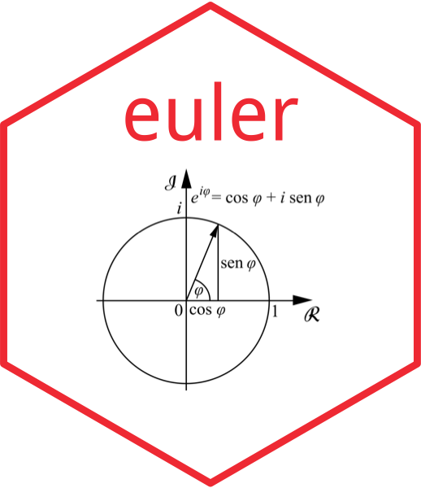

---
output:
  md_document:
    variant: markdown_github
---

<!-- README.md is generated from README.Rmd. Please edit that file -->

```{r, echo = FALSE}
knitr::opts_chunk$set(
  collapse = TRUE,
  comment = "",
  fig.path = "tools/images/README-"
)
library(euler)
```

# euler 

[](http://www.repostatus.org/#active)
[](http://cran.r-project.org/package=euler)
[](https://travis-ci.org/nathaneastwood/euler)
[](https://codecov.io/gh/nathaneastwood/euler)
[](https://opensource.org/licenses/MIT)

## Overview

The goal of `euler` is to offer R solutions to [Project Euler](https://projecteuler.net) problems.

## Installation

You can install the package directly from GitHub using the [`devtools` package](https://github.com/r-lib/devtools).

```{r installation, eval = FALSE}
# install.packages("devtools")
install_github("nathaneastwood/euler")
```

## Useage

We can, for example, solve [Euler problem 3](https://projecteuler.net/problem=3) using the following:

```{r euler3}
euler_3(600851475143)
```

Or we could solve [Euler problem 4](https://projecteuler.net/problem=4) using the following:

```{r euler4}
euler_4(3)
```

## Problems solved so far

This package currently offers solutions to the following Euler problems:

<details>
<summary>Click to expand</summary>

* [Problem 1](https://projecteuler.net/problem=1)
* [Problem 2](https://projecteuler.net/problem=2)
* [Problem 3](https://projecteuler.net/problem=3)
* [Problem 4](https://projecteuler.net/problem=4)
* [Problem 5](https://projecteuler.net/problem=5)
* [Problem 6](https://projecteuler.net/problem=6)
* [Problem 7](https://projecteuler.net/problem=7)
* [Problem 8](https://projecteuler.net/problem=8)
* [Problem 9](https://projecteuler.net/problem=9)
* [Problem 10](https://projecteuler.net/problem=10)
* [Problem 11](https://projecteuler.net/problem=11)
* [Problem 12](https://projecteuler.net/problem=12)
* [Problem 13](https://projecteuler.net/problem=13)
* [Problem 14](https://projecteuler.net/problem=14)
* [Problem 18](https://projecteuler.net/problem=18)
* [Problem 67](https://projecteuler.net/problem=67)
</details><break>

## Explaining Methodology

You will notice that our code has minimal comments and that we haven't provided any detail to how we came up with our solutions. We believe that in doing so, we would be taking away the fun for others. We came to this decision because of the nature of Project Euler. Take this excerpt from there website.

> I learned so much solving problem XXX so is it okay to publish my solution elsewhere?
>
> It appears that you have answered your own question. There is nothing quite like that "Aha!" moment when you finally beat a problem which you have been working on for some time. It is often through the best of intentions in wishing to share our insights so that others can enjoy that moment too. Sadly, however, that will not be the case for your readers. Real learning is an active process and seeing how it is done is a long way from experiencing that epiphany of discovery. Please do not deny others what you have so richly valued yourself.

We do, however, plan on writing about more general content aimed at solving maths problems (e.g. efficient code solutions for finding primes) in R, if not linked to specific problems.

## Contributing

Bug reports, suggestions, and especially code contributions are welcome. Please see [CONTRIBUTING.md](https://github.com/nathaneastwood/euler/blob/master/CONTRIBUTING.md). Maintainers and contributors must follow this repository's [code of conduct](https://thoughtbot.com/open-source-code-of-conduct).
